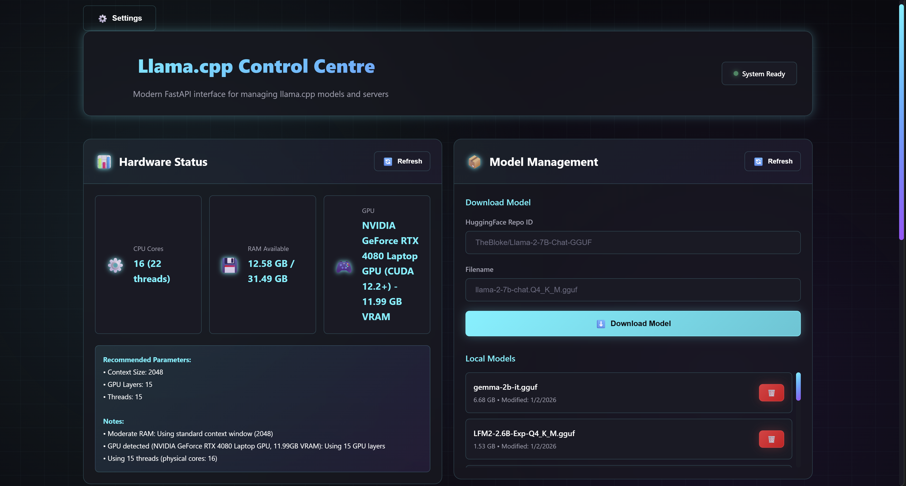
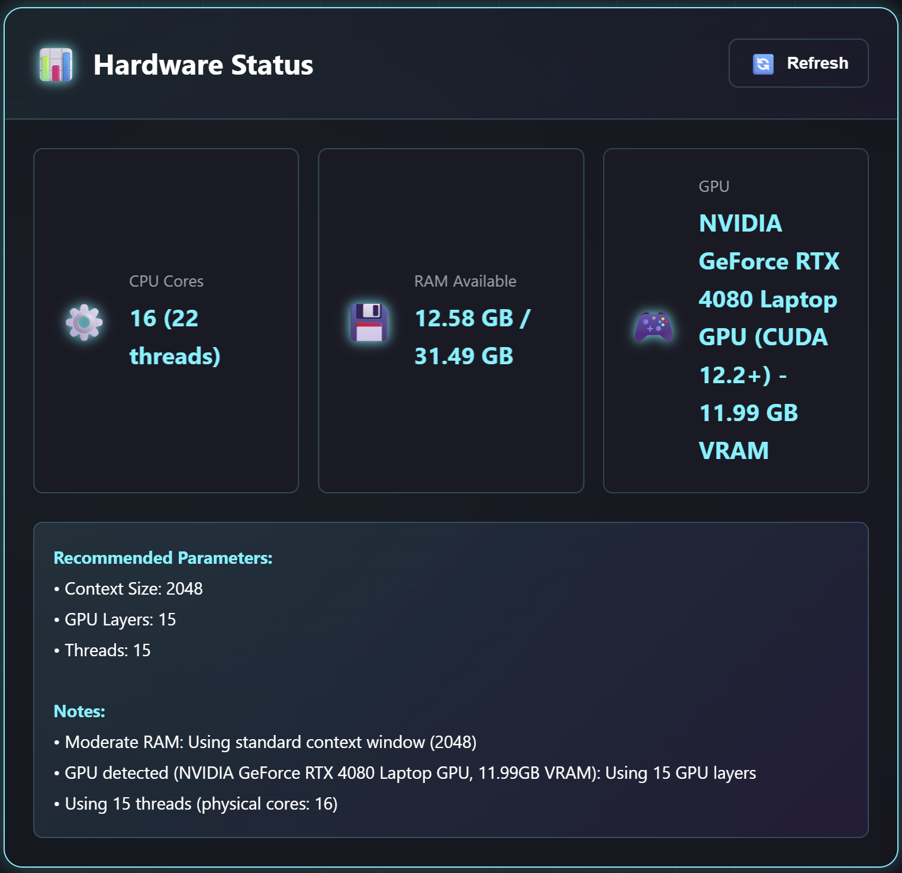
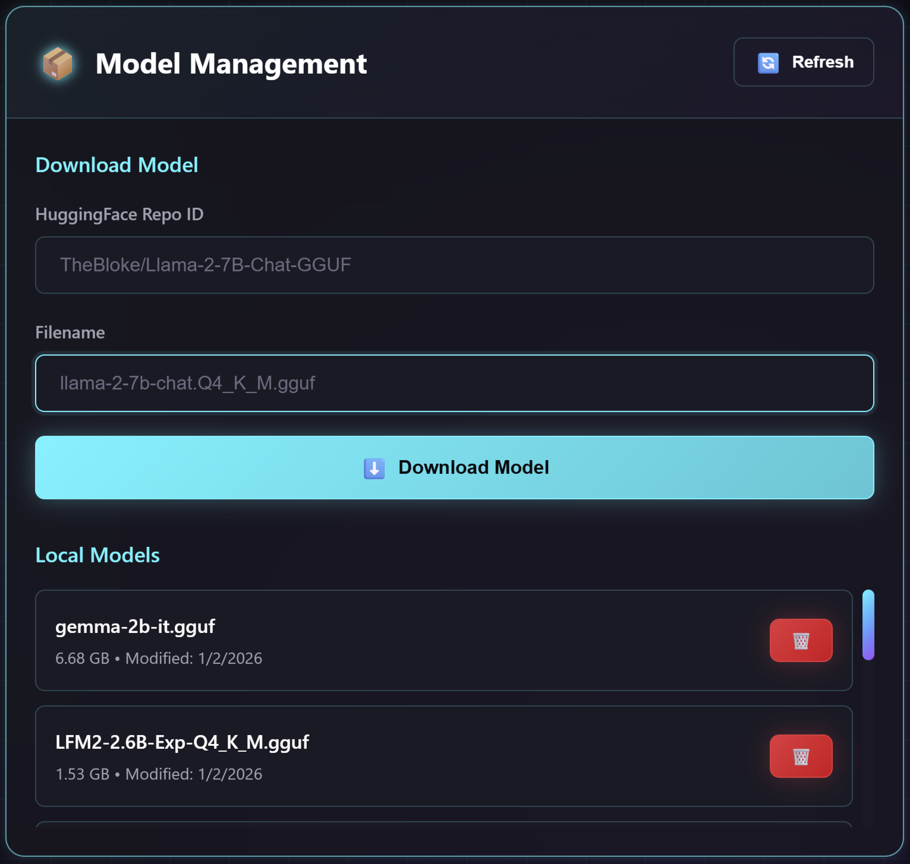
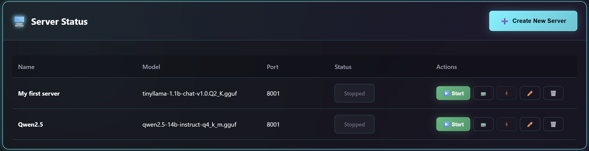
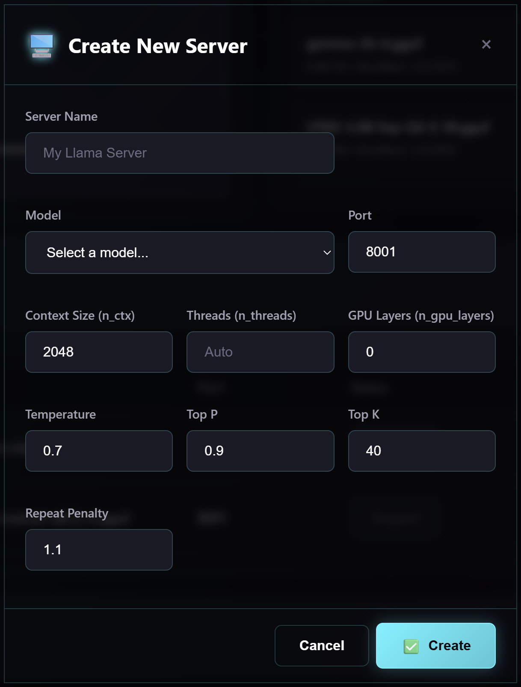
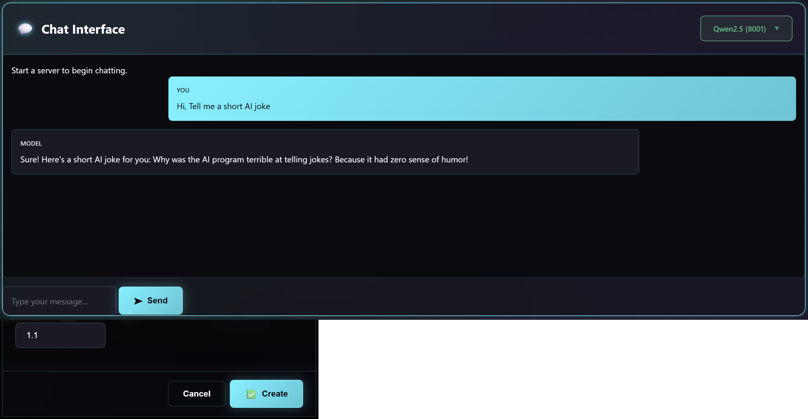
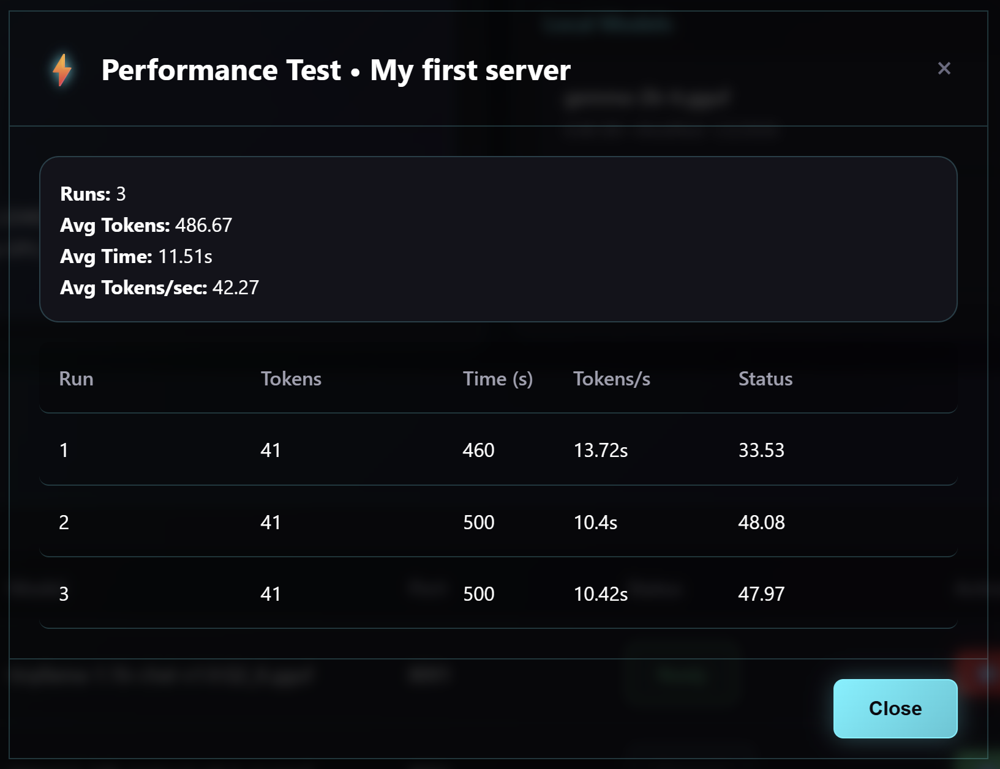

# Llama.cpp Control Centre

A modern FastAPI-based web interface for managing llama.cpp models and servers with intelligent hardware optimization.



## Features

### 🖥️ Server Management
- Create, edit, and delete server configurations
- Start/stop servers with real-time status updates
- Automatic parameter recommendations based on hardware and model size
- Support for multiple concurrent servers on different ports

### 📦 Model Management
- Download models directly from HuggingFace
- View and manage local model library
- Automatic model size detection for parameter optimization

### 📊 Hardware Detection
- Automatic CPU, RAM, GPU, and VRAM detection
- CUDA version detection and display
- Intelligent parameter recommendations based on system specs
- Support for NVIDIA GPUs with CUDA acceleration

### 💬 Chat Interface
- Real-time chat with running llama.cpp servers
- OpenAI-compatible API integration
- Model selection dropdown for active servers
- Message history and streaming responses

### ⚡ Performance Testing
- Built-in benchmarking for model performance
- Multiple test runs with statistical analysis
- Tokens per second calculation and reporting

### 📟 Console Monitoring
- Real-time server log streaming
- Color-coded console output
- Clear and filter functionality
- Auto-refresh for live log updates

## Installation

1. **Clone the repository:**
   ```bash
   git clone https://github.com/yourusername/llama.cpp-control-centre.git
   cd llama.cpp-control-centre
   ```

2. **Install dependencies:**
   ```bash
   pip install -r requirements.txt
   ```

3. **Run the application:**
   ```bash
   python main.py
   ```

4. **Access the web interface:**
   Open your browser and navigate to `http://localhost:8000`

## Configuration

### Hardware Detection
The system automatically detects:
- **CPU**: Physical/logical cores and frequency
- **Memory**: Total and available RAM
- **GPU**: NVIDIA GPU name, VRAM, and CUDA version
- **Platform**: Operating system information

### Parameter Recommendations
Based on your hardware and selected model, the system recommends:
- **Context Size** (n_ctx): Based on available RAM
- **GPU Layers** (n_gpu_layers): Calculated from VRAM and model size
- **Threads** (n_threads): Physical cores minus system overhead
- **Quantization**: Suggested model quantization levels

## Usage

### Creating a Server
1. Click "Create New Server"
2. Enter a server name
3. Select a model from your local library
4. **Automatic recommendations** will appear - click OK to apply optimal settings
5. Configure additional parameters as needed
6. Click "Create" to save the configuration

### Managing Servers
- **Start/Stop**: Use the action buttons in the server table
- **Edit**: Modify existing server configurations
- **Console**: View real-time server logs
- **Benchmark**: Test model performance

### Chat Interface
1. Start a server to enable chat
2. Select the running model from the dropdown
3. Type your message and press Enter or click Send
4. View streaming responses in real-time

## API Endpoints

### Hardware
- `GET /api/hardware/info` - Get system hardware information
- `GET /api/hardware/recommendations?model_size_gb=X` - Get parameter recommendations

### Models
- `GET /api/models/list` - List downloaded models
- `POST /api/models/download` - Start model download
- `GET /api/models/download/status` - Get download progress
- `DELETE /api/models/delete/{model_name}` - Delete a model

### Servers
- `GET /api/servers` - List server configurations
- `POST /api/servers` - Create new server
- `PUT /api/servers/{server_id}` - Update server configuration
- `DELETE /api/servers/{server_id}` - Delete server
- `POST /api/servers/{server_id}/start` - Start server
- `POST /api/servers/{server_id}/stop` - Stop server
- `GET /api/servers/{server_id}/benchmark` - Run performance test
- `GET /api/server/logs/{server_id}` - Get server logs

### Chat
- `POST /api/chat` - Send chat message (streaming supported)
- `GET /api/server/status` - Get running server status

## UI Elements

### 📸 Screenshots Overview

The following screenshots are recommended to fully document the Llama.cpp Control Centre interface:

#### 1. **Hardware Status Card** 

*Shows detected CPU cores, RAM availability, GPU info with CUDA version, and VRAM*

#### 2. **Model Management Card**

*Download form and compact models list with optimized 200px height*

#### 3. **Server Status Table**

*Table showing configured servers with status badges and action buttons*

#### 4. **Create/Edit Server Model**

*Server configuration form with intelligent parameter recommendations dialog*

#### 5. **Chat Interface**

*Real-time chat with model selection dropdown and streaming responses*

#### 7. **Benchmark Model**

*Performance test results showing tokens/second and statistical analysis*

### 🖥️ Component Details

- **Hardware Status Card**: Displays system information including CPU cores, available RAM, GPU name with CUDA version, and VRAM capacity. Features intelligent parameter recommendations based on detected hardware.

- **Model Management**: Interface for downloading models from HuggingFace and managing local model library. Includes progress tracking and optimized list display.

- **Server Status Table**: Comprehensive view of all configured servers with real-time status indicators (Ready/Initializing/Stopped) and action buttons for start/stop/edit/delete/console/benchmark operations.

- **Create/Edit Server model**: Configuration dialog with form validation, automatic parameter recommendations based on hardware and model size, and support for both creating new servers and editing existing configurations.

- **Chat Interface**: Real-time messaging interface with OpenAI-compatible API integration, model selection dropdown for active servers, message history, and streaming response support.

- **Console model**: Live log monitoring with terminal-style display, auto-refresh capabilities, and server log streaming for debugging.

- **Benchmark model**: Performance testing interface with multiple test runs, statistical analysis, tokens per second calculations, and detailed results reporting.

<!-- Legacy placeholder for reference -->
<!-- 
- Hardware Status Card: Shows detected CPU, RAM, GPU with CUDA version
- Model Management Card: Download and manage local models with optimized list height
- Server Status Table: View and manage all configured servers
- Create/Edit Server model: Form with intelligent parameter recommendations
- Chat Interface: Real-time conversation with streaming responses
- Console model: Live server log monitoring
- Benchmark model: Performance testing interface
-->

## Technical Details

### Architecture
- **Backend**: FastAPI with async/await patterns
- **Frontend**: Vanilla JavaScript with modern CSS
- **Server Management**: Subprocess-based llama.cpp server control
- **Real-time Updates**: WebSocket-like polling for live status

### Hardware Optimization
- CUDA version detection via `nvidia-smi` and `nvcc`
- Driver version to CUDA version mapping
- Fallback detection using PyTorch when available
- Memory-aware parameter calculation

### Security
- Input validation and sanitization
- Safe subprocess execution with timeouts
- CORS configuration for API access
- No hardcoded credentials or paths

## Troubleshooting

### Common Issues
1. **CUDA not detected**: Install NVIDIA drivers and CUDA toolkit
2. **Models not appearing**: Check models directory path in Settings
3. **Server won't start**: Verify model file exists and check console logs
4. **Performance issues**: Use benchmark to identify bottlenecks

### Debug Mode
Enable console logging in browser developer tools for detailed debugging information.

## Contributing

1. Fork the repository
2. Create a feature branch
3. Make your changes
4. Add tests if applicable
5. Submit a pull request

## License

This project is licensed under the MIT License - see the LICENSE file for details.
